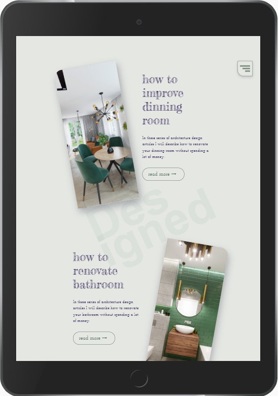
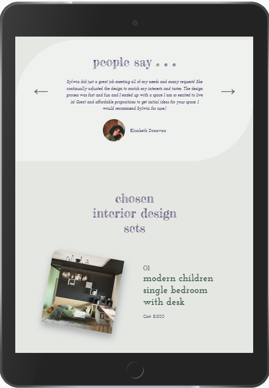

**If you want to try it out, click here: [Sylwia Design webpage](https://ulakrawczyk.github.io/sylwia-design/)**

### This is a landing page for architect developed to practise my skills:
* semantic html5
* css3 with grid and flexbox layout
* sass
* js with intersection observer features
* rwd

## Page is based on WTF Webpack Starter Kit 
## Available scripts

`npm run start` - runs development mode

`npm run build` - runs build process for production

`npm run publish` - runs build process and publish the page using `gh-pages` branch

